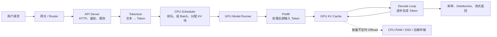

# AI Infra 推理快速入门

目标不是立即会优化推理内核，而是能够顺着一次请求讲清楚 CPU、GPU、KV Cache 各自做什么；听到指标和优化术语时，知道它在解决哪个瓶颈。

## 1. 一次请求如何完成



基本过程：

1. CPU 接收请求并渲染 Chat Template。
2. Tokenizer 把文本变成 Token ID。
3. CPU Scheduler 决定请求何时执行、和哪些请求组成 Batch。
4. GPU 做 Prefill，处理所有输入 Token 并产生 KV Cache。
5. GPU 进入 Decode，循环生成新 Token。
6. 输出被组织、反分词并通过网络流式返回。

## 2. “CPU 侧”的三种含义

| 语境 | 实际含义 |
|---|---|
| CPU 机头 / Host CPU | GPU 服务器里的主 CPU，负责请求、调度、分词、进程协调、网络和数据搬运 |
| CPU 推理 | 模型算子本身运行在 CPU 上，依赖 AMX/AVX、oneDNN、Inductor 等 |
| CPU 内存层 | 权重或 KV Cache 放进主机内存，需要时通过 PCIe/CXL 搬到 GPU |

当前最应该关注第一和第三种。

机头 CPU 的关键指标：

- 单核性能和频率：Scheduler 可能对单核性能敏感。
- 物理核数：API、Scheduler、Worker 和后台线程都需要 CPU 时间。
- 内存容量与带宽：影响模型加载、预处理和 Offload。
- PCIe 通道与拓扑：影响 CPU↔GPU 数据搬运。
- NUMA：进程、内存、GPU 和 NIC 是否处在合适的 Socket。
- 网络：影响多机推理、PD 分离和 KV 传输。

CPU 总利用率低不代表 CPU 不是瓶颈。关键 Scheduler 线程可能已经占满一个核，而其他核仍然空闲。

## 3. Prefill 与 Decode

### Prefill

Prefill 把整个输入 Prompt 一次性送入模型。例如输入为 8K Token，Prefill 会处理这些 Token，并在每一层产生 KV Cache。

通常具有以下特点：

- 矩阵规模较大，更偏 Compute-bound。
- 主要影响 TTFT，即首 Token 延迟。
- 长 Prompt 可能干扰正在 Decode 的请求。

### Decode

Decode 基于已有 KV Cache，一轮生成一个或少量新 Token，再把新 Token 的 KV 追加进去。

通常具有以下特点：

- 单轮计算规模较小。
- 不断读取模型权重和 KV Cache。
- 更偏 Memory-bandwidth-bound。
- 主要影响 TPOT/ITL，即输出 Token 间隔。

“Prefill 吃算力，Decode 吃带宽”是有用的第一阶近似，但不是对所有模型、Batch 和硬件都成立的绝对定律。

## 4. KV Cache 是什么

Transformer 生成新 Token 时，需要关注前面的 Token。如果每轮都重新计算历史 Token 的 Key 和 Value，成本会很高，所以每层会保存历史 Token 的 K/V，下一轮直接读取。

KV Cache 不是答案缓存，也不是语义缓存，而是 Attention 的中间状态。

标准 MHA/GQA 模型的粗略容量公式：

```text
每 Token 的 KV 字节数
≈ 2 × 层数 × KV Head 数 × Head Dim × 每元素字节数
```

其中 `2` 代表 K 和 V。例如：

```text
32 层
8 个 KV Head
Head Dim = 128
BF16 = 2 字节

2 × 32 × 8 × 128 × 2
= 131072 字节
≈ 128 KiB / Token
```

一条 8K Token 的序列大约需要 1 GiB KV。100 条这样的活跃序列，逻辑 KV 容量约为 100 GiB。

实际每卡占用还取决于：

- TP 等并行分片方式。
- Block 大小、对齐和内存预留。
- MHA、MQA、GQA、MLA 或混合模型结构。
- KV 精度，例如 BF16、FP8。
- Sliding Window 等 Attention 策略。

核心认识是：权重容量基本固定，而 KV Cache 随活跃 Token 数、上下文长度和并发增长。

## 5. 围绕 KV Cache 的术语

| 词 | 含义 |
|---|---|
| PagedAttention | 把 KV 切成固定大小的块，按需分配，并允许物理内存不连续 |
| Block / Page | 一段固定数量 Token 对应的 KV 存储单元 |
| Block Table | 请求的逻辑 Token 块到物理 KV 块的映射 |
| Prefix Cache | 请求拥有相同 Token 前缀时，复用已经计算的 KV |
| RadixAttention | SGLang 使用 Radix Tree 管理和匹配共享前缀 |
| KV 水位 | KV 内存池已经使用的比例 |
| Eviction | KV 不够时驱逐暂时不用的块 |
| Preemption | 暂停部分请求，释放执行或 KV 资源 |
| Recompute | KV 被释放后，需要时重新做 Prefill |
| KV Offload | 把 GPU KV 搬到 CPU RAM、SSD 或远端层级 |
| KV Quantization | 用更低精度保存 KV，减少容量和带宽 |
| KV Transfer | PD 分离时把 Prefill 产生的 KV 传给 Decode 实例 |

Prefix Cache 匹配的是相同 Token 前缀，而不是语义相近的文本。Chat Template、特殊 Token、LoRA 或模型配置不同，都可能造成无法复用。

Prefix Cache 主要节省 Prefill，不会直接减少生成长答案所需的 Decode 步数。

KV Offload 是以 CPU 内存容量换 GPU 容量，但要支付 PCIe、CXL、网络或存储的传输开销。系统会尝试把数据搬运和计算重叠，但 Offload 不等于免费扩容。

## 6. Scheduler 与 Continuous Batching

传统静态 Batching 往往需要等待整个 Batch 完成。Continuous Batching 会在每个 Decode Step 重新安排请求：

- 完成的请求立即退出。
- 新请求可以动态加入。
- Scheduler 经常按 Token Budget 而不只是请求数组织 Batch。
- 活跃请求的输入和输出长度可以不同。

常见参数：

- `max_num_seqs`：一轮最多处理多少条序列。
- `max_num_batched_tokens`：一轮最多处理多少 Token。

它们不是越大越好。调大通常有利于吞吐，但可能增加排队时间、TTFT、KV 占用和尾延迟。

### Chunked Prefill

将长 Prefill 切成多个 Token Chunk，穿插在 Decode 请求之间，避免一个长 Prompt 长时间阻塞其他请求。

### Overlap Scheduling

CPU 在 GPU 执行当前 Batch 时准备下一个 Batch：

```text
GPU:  [执行 Batch N] [执行 Batch N+1]
CPU:       [准备 N+1]    [准备 N+2]
```

它试图隐藏 CPU 调度、元数据准备和 Kernel Dispatch 开销。

## 7. vLLM、SGLang 与 PyTorch 的关系

它们不完全处于同一层。

| 组件 | 定位 |
|---|---|
| PyTorch | 张量、模型、算子、分布式通信与编译基础平台 |
| Hugging Face Transformers | 模型结构、配置、Tokenizer 和权重生态 |
| vLLM | 面向在线/离线 LLM 推理的 Serving Engine |
| SGLang | LLM Serving Runtime，并提供结构化生成等能力 |
| Triton | 编写和生成 GPU Kernel 的语言与编译工具 |
| CUDA/cuBLAS/CUTLASS/FlashAttention | 更底层的 GPU 执行与高性能 Kernel |
| NCCL | GPU 间集合通信，例如 AllReduce、AllGather 和 AllToAll |

### PyTorch

必须认识的词：

- Eager Mode：Python 执行到哪里，算子运行到哪里。
- Computational Graph：模型计算图。
- `torch.compile`：捕获计算图并优化执行。
- TorchDynamo：从 Python 程序中捕获图。
- TorchInductor：PyTorch 默认编译后端。
- Triton：Inductor 在 GPU 上生成 Kernel 的重要基础。
- Graph Break：某段逻辑无法捕获，需要退回 Eager。
- CUDA Graph：记录并重放一组 GPU 操作，降低 CPU 发射开销。

### vLLM

可以记成：以高效 KV 内存管理和动态调度为中心的通用 LLM Serving Engine。

重点词：PagedAttention、Continuous Batching、Prefix Caching、Chunked Prefill、Speculative Decoding、CUDA Graph、TP/PP/DP/EP、PD Disaggregation。

### SGLang

可以记成：以高性能 Serving Runtime、RadixAttention 前缀复用和调度优化为特色的系统。

重点词：RadixAttention、Radix Cache、CPU Scheduler、Overlap Scheduler、Continuous Batching、Speculative Decoding、PD Disaggregation、Structured Output。

不要简单记成“谁一定更快”。结果取决于模型、硬件、输入输出长度、并发、缓存命中率和具体版本。

## 8. 分布式推理术语

| 词 | 含义 | 主要代价 |
|---|---|---|
| TP，Tensor Parallel | 一层模型拆到多张 GPU | 高频 AllReduce/AllGather |
| PP，Pipeline Parallel | 不同层放到不同 GPU 或节点 | 流水线气泡和阶段不均衡 |
| DP，Data Parallel | 多份模型副本处理不同请求 | 权重和 KV 重复占用 |
| EP，Expert Parallel | MoE 的 Expert 分布到不同 GPU | AllToAll 通信 |
| SP/CP | 沿序列维度拆分长上下文 | Attention 通信 |
| PD 分离 | Prefill 与 Decode 使用不同实例或资源池 | KV 传输与路由复杂度 |

PD 分离的主要目标是独立优化 TTFT 和 TPOT，并隔离 Prefill 对 Decode 尾延迟的影响。它不保证吞吐一定提升，因为还需要支付 KV 传输和资源碎片化成本。

## 9. 性能指标

| 指标 | 含义 |
|---|---|
| TTFT | 请求到第一个输出 Token 的时间 |
| TPOT | 每个输出 Token 平均耗时 |
| ITL | 相邻输出 Token 的间隔 |
| E2E Latency | 请求整体完成时间 |
| RPS/QPS | 每秒完成多少请求 |
| Input Token Throughput | 每秒处理多少输入 Token |
| Output Token Throughput | 每秒生成多少输出 Token |
| p50/p95/p99 | 延迟分位数，p99 反映尾延迟 |
| Goodput | 满足 SLO 的有效吞吐 |
| Queue Time | 请求在 Scheduler 中等待的时间 |
| KV Cache Usage | KV 池水位 |
| Prefix Cache Hit Rate | 前缀计算被复用的比例 |
| Preemption/Recompute | KV 或调度压力是否导致暂停、重算 |

看 Benchmark 时必须问：

- 什么模型和精度？
- 几张什么 GPU？
- 输入和输出长度是什么分布？
- 并发或请求到达率是多少？
- 单请求 Token/s 还是系统总 Token/s？
- 平均值还是 p99？
- Prefix Cache 是否命中？
- 是否满足 TTFT/TPOT SLO？

离开这些条件谈“吞吐提升 50%”通常没有意义。

## 10. 常见黑话翻译

| 说法 | 实际意思 |
|---|---|
| CPU 侧顶不住 | 分词、调度、输出或网络不能持续给 GPU 提供工作 |
| GPU 有 Bubble | GPU 两轮执行之间有空闲，可能在等 CPU、通信或数据 |
| Decode 是 Memory-bound | 性能主要受权重/KV 读取带宽限制 |
| 长 Prefill 把 ITL 打爆 | 长输入抢占 GPU，导致已有请求输出卡顿 |
| 上 Chunked Prefill | 把长输入切开，减小对 Decode 的阻塞 |
| KV 水位太高 | 活跃 Token 太多，KV 池接近容量上限 |
| Prefix 命中率低 | 请求之间缺少足够长的相同 Token 前缀 |
| TP 拉大反而慢 | 跨卡通信成本超过单卡计算减少的收益 |
| 绑核、对齐 NUMA | 让进程、内存、GPU 和 NIC 尽量位于同一 Socket |
| 做 PD 分离 | Prefill 与 Decode 使用不同资源池并传输 KV |
| 开 CUDA Graph | 减少 CPU 逐个发射 GPU Kernel 的开销 |
| 看 Goodput | 吞吐只有在满足延迟 SLO 时才具有业务价值 |
| Tokenizer 成瓶颈 | 文本预处理速度跟不上 GPU 消耗请求的速度 |
| 调大 Batch | 尝试用延迟和 KV 容量换取更高系统吞吐 |

## 11. CPU 侧排障顺序

1. 是 TTFT 差，还是 TPOT/ITL 差？
2. 时间花在排队、CPU 处理、GPU 执行还是通信？
3. GPU 利用率低时，CPU 是否有某一个关键核跑满？
4. Tokenizer、Scheduler、Detokenizer 分别耗时多少？
5. 是否有线程抢核或大量上下文切换？
6. CPU 内存与 GPU 是否跨 NUMA？
7. PCIe、NIC 和 GPU 分别连接到哪个 CPU Socket？
8. KV 水位、命中率、Eviction 和 Recompute 是否异常？
9. 是否有超长 Prefill 干扰 Decode？
10. 优化改善的是平均值，还是 p99 与 Goodput？

## 12. 最值得记住的五句话

1. PyTorch 是基础执行和编译平台；vLLM/SGLang 是上层 LLM Serving Engine。
2. Prefill 主要影响 TTFT，Decode 主要影响 TPOT/ITL。
3. 权重基本固定，KV Cache 随上下文和并发增长。
4. GPU 利用率低不一定是 GPU 问题，也可能是 CPU、通信或数据搬运没有跟上。
5. 任何性能结论都必须绑定模型、硬件、输入输出长度、并发和 SLO。

## 13. 官方入口

- [vLLM Documentation](https://docs.vllm.ai/en/latest/)
- [SGLang Documentation](https://docs.sglang.io/)
- [PyTorch Compiler](https://docs.pytorch.org/docs/main/user_guide/torch_compiler/torch.compiler.html)
- [vLLM Automatic Prefix Caching](https://docs.vllm.ai/en/stable/features/automatic_prefix_caching/)
- [vLLM KV Offloading](https://docs.vllm.ai/en/latest/features/kv_offloading_usage/)
