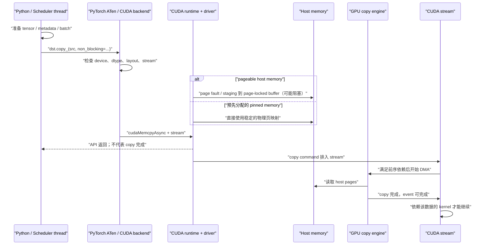
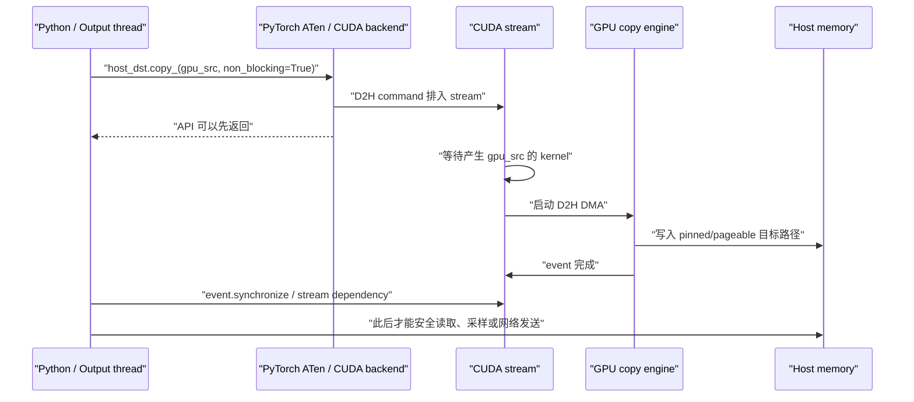

# 推理过程中的 H2D / D2H：流程、CPU 开销与实践验证

这份实验回答四个问题：

1. 一次 H2D / D2H 从 Python 到 DMA 完成，经过哪些层？
2. Python 调度、OS 调度、中断、缺页和 NUMA 分别会影响哪一段？
3. 如何把“CPU 提交耗时”“GPU 实际搬运耗时”和“端到端可见耗时”分开？
4. 如何用 PyTorch Profiler、Nsight Systems、`perf` 和系统计数互相验证？

实验假设在 Linux + NVIDIA A100 上执行，入口是
[`labs/h2d_d2h_benchmark.py`](../labs/h2d_d2h_benchmark.py)。

昇腾 910B4 / CANN / `torch_npu` 的对应流程、工具映射与验证入口见
[《昇腾 910B4 Qwen3.6-27B-W8A8 端到端同步等待分析手册》](05-ascend-910b4-h2d-d2h-profiling.md)；
H2D/D2H 微基准只作为其中的补充校准。

如果目标是分析真实 vLLM 推理中 `cudaDeviceSynchronize`、
`cudaEventSynchronize` 等 Host API 的等待时间，本微基准只能作为链路校准对照；
主实验见
[《A100 INT8 W8A8 vLLM 推理中的 CUDA 同步等待》](06-vllm-cuda-sync-profiling.md)。

## 1. 先给结论

- H2D / D2H 的**软件流程**在不同 NVIDIA GPU 上大体相同，但性能并非与硬件无关。A100 是 PCIe 卡还是 SXM、CPU 到 GPU 的 PCIe 拓扑、NUMA、IOMMU、主机内存带宽、GPU copy engine 和系统负载都会改变结果。
- Python 通常参与张量准备、框架分派和 CUDA work enqueue，不逐字节搬运已经提交的 DMA。它更容易增加小传输的固定开销、两次提交之间的 gap，以及 p95/p99 尾延迟。
- OS 调度、上下文切换、CPU migration、page fault 和同步唤醒会影响 CPU 侧时间。硬中断/softirq 可以造成干扰，但不应先验地解释成“每次 PCIe DMA 都由 Python 线程处理中断完成”。
- 大块 pinned-memory copy 更容易接近链路/内存带宽上限；小块 copy 更容易被 Python、ATen/CUDA API、event 和同步的固定成本主导。
- `non_blocking=True` 只说明不主动在该 API 后做同样的主机同步，不等于数据已经可用，也不保证 copy 与计算重叠。可靠重叠还需要 pinned host memory、独立 non-default stream、可并发的硬件资源和真实无依赖的工作。
- D2H 异步拷贝尤其要注意：CPU 在对应 event/stream 完成前不能读取目标 buffer。本实验验证数据前会等待完成。
- timeline 用于定位因果和空洞；不应把 profiler 下的耗时直接当作无 profiler 时的最终 benchmark 数字。

## 2. 推理里哪些数据真的会 H2D / D2H

| 场景 | 方向 | 典型粒度 | 常见性能性质 |
|---|---|---:|---|
| Token IDs、position、slot/block table、采样元数据 | H2D | B～KiB | 固定提交成本占比高 |
| CPU 侧准备的输入 embedding / multimodal feature | H2D | KiB～MiB | packing、pinning 与 DMA 都可能可见 |
| GPU 采样后的 token ID、完成标记 | D2H | B～KiB | 同步和唤醒常比数据搬运更贵 |
| 把完整 logits 拉回 CPU 采样 | D2H | KiB～MiB/step | 可能直接落在 decode 关键路径 |
| KV cache offload / reload | D2H / H2D | MiB～GiB | 链路带宽、NUMA、分块和重叠最关键 |
| 权重加载或 CPU offload | H2D / D2H | MiB～GiB | 往往是阶段性大传输 |

因此不能只测一个 64 MiB buffer。实验默认同时测 `4KiB,1MiB,16MiB,64MiB`：

- 4 KiB 用来放大 Python/CUDA API/同步的固定开销。
- 16～64 MiB 用来观察稳态带宽。
- 完整验证脚本额外测 256 MiB，用来检查大块传输和内存层行为。

## 3. H2D 的完整拆解



分层看：

1. **数据准备**：tokenize、batch packing、Python 容器遍历、CPU tensor 填充、可能的类型/布局转换。
2. **框架分派**：Python → PyTorch dispatcher → ATen CUDA copy 实现，选择 device、当前 stream 和 copy 类型。
3. **host memory 可 DMA 化**：
   - pinned/page-locked 页地址稳定，适合直接异步 DMA；
   - pageable memory 需要 runtime/driver 处理驻留与 staging，开销更不可预测；
   - 临时在主线程调用 `pin_memory()` 本身是一次 CPU copy/注册工作，不能算免费优化。
4. **enqueue**：CUDA API 把 command 放到 stream。异步 API 此时可以很快返回。
5. **排队与依赖**：copy engine 可能还在忙，或同一 stream 前面还有 kernel/copy。
6. **DMA**：copy engine 经主机互连读取 host memory、写入 HBM。
7. **消费**：同一 stream 上依赖输入的 kernel 在 copy 完成后执行；跨 stream 需要显式 event 依赖。

## 4. D2H 的完整拆解

D2H 的前半段相反，但 CPU 可见性让它更容易误用：



D2H 的关键路径可以写成：

```text
GPU producer kernel
→ stream dependency
→ D2H DMA
→ completion notification / waiting thread 被唤醒
→ CPU 读取
→ detokenize / serialize / send
```

如果只在 Python 里测 `copy_()` 调用返回，异步 D2H 看起来可能只有几十微秒，但数据还没有到达 CPU。反过来，如果紧接着 `.item()`、打印 tensor、转 NumPy 或做 CPU 运算，隐式同步会被记到“后一个操作”，造成错误归因。

## 5. 正确的时间模型

对单次 copy：

```text
T_pipeline
= T_cpu_prepare
 + T_framework_and_cuda_api
 + T_stream_queue
 + T_dma
 + T_completion_wait_and_wakeup
```

对 pageable host memory 还要关注：

```text
T_pageable_path += T_fault_or_residency + T_pageable_to_pinned_staging
```

对 `B` 字节的大块 copy，第一阶模型是：

```text
T_dma(B) ≈ T_fixed + B / BW_effective
```

小 `B` 时固定开销主导；大 `B` 时有效带宽主导。`BW_effective` 还会受 PCIe、NUMA 远端内存、DDR 带宽、IOMMU、copy-engine 争用和双向并发影响。

本实验刻意分开以下指标：

| 指标 | 测量方式 | 能回答什么 | 不能回答什么 |
|---|---|---|---|
| `cpu_prepare_ms` | CPU monotonic clock | 每次 enqueue 前的 Python 工作 | DMA 时间 |
| `host_api_ms` | `copy_()` 前后 CPU clock | 主机调用/阻塞了多久 | 异步 copy 何时完成 |
| `device_copy_ms` | copy 两侧 CUDA event | stream 上实际 copy 区间 | Python gap、同步唤醒 |
| `completion_ms` | submit 到 event wait 返回 | 当前 copy 对 CPU 可见的完成延迟 | batch 中每个 copy 的独立完成时间 |
| `pipeline_ms` | prepare 到完成 | 端到端关键路径/摊销吞吐 | 纯 PCIe 带宽 |
| `device_copy_gbps_p50` | bytes / CUDA event time | 大块 copy engine 有效搬运率 | 应用端吞吐 |
| `effective_gbps_p50` | bytes / pipeline time | 应用实际获得的传输率 | 纯硬件链路能力 |

`sync_policy=each` 每次都等，适合看关键路径延迟和尾部；`sync_policy=batch` 连续 enqueue 后只等最后一个 event，适合看摊销吞吐和 Python 是否能持续喂满 copy engine。

## 6. CPU 侧可能慢在哪里

### 6.1 Python 与框架调度

重点不是模糊地看“Python 占了多少 CPU”，而是看 CUDA API 提交之间是否出现空洞：

- scheduler 在 Python 中遍历请求、拼 metadata、更新 block table；
- 创建许多小 tensor、对象分配与引用计数；
- Python GC；
- GIL 被 tokenizer、HTTP/output thread 或其他 Python thread 竞争；
- eager 模式中频繁的 Python → dispatcher → CUDA API 边界；
- 每步显式 `.item()`、日志或 debug print 触发同步；
- GPU 很快完成小 kernel/copy，CPU 来不及提交下一步。

验证方法：

1. 看 `host_api_ms` 是否高；
2. 在 timeline 上看相邻 `device_submit` / CUDA API 之间是否有 CPU gap；
3. 对比 `--python-work 0` 与非零；
4. 对比 `--interference none` 与 `gil`；
5. 看 Nsight Systems 的 Python GIL、CPU sample 和 thread scheduling 轨道。

### 6.2 OS 调度

可能表现为：

- benchmark 线程被 preempt，`cpu_prepare_ms` 或 `host_api_ms` 出现长尾；
- CPU migration 造成 cache/TLB locality 变差；
- 同核上的 IRQ、ksoftirqd、网络或存储线程抢占；
- 同 socket 其他进程争用内存带宽；
- 等待 CUDA event 的线程被唤醒后不能立即上 CPU；
- CPU frequency/governor 或 cgroup quota 造成不稳定。

判断时要把“运行态不足”和“函数本身执行慢”分开。Nsight Systems 的 thread state / context-switch 轨道和 `perf sched timehist` 比总 CPU 利用率更有用。

### 6.3 中断与 softirq

这里需要克制：

- DMA 数据面由设备/copy engine 搬运，Python 不逐 cache line 参与。
- CUDA driver 可能用中断、轮询或混合策略处理完成与等待，具体策略和版本有关。
- 网络、NVMe、timer、reschedule IPI 等其他 IRQ/softirq 可以抢占关键 CPU。
- `/proc/interrupts`、`/proc/softirqs` 是全机计数。某个计数与测试同时增长，只能建立相关性，不能单独证明因果。

可信验证至少需要同时看到：

1. timeline 上关键线程在异常点被 deschedule；
2. 相同窗口有 IRQ/softirq 或别的 runnable task；
3. 绑到较干净的 CPU、调整 IRQ affinity 或隔离干扰后，异常可重复地消失；
4. CUDA event 的 `device_copy_ms` 和 CPU 侧 `pipeline_ms` 如何变化符合假设。

如果 IRQ 增加但 GPU event 时间稳定、只有 wait 返回变慢，更像 CPU 唤醒/调度问题；如果 GPU event 本身也显著变慢，才继续查链路、NUMA、copy engine 或内存带宽争用。

### 6.4 Page fault、pinning 与 NUMA

- 首次触碰 pageable buffer 会触发 page allocation/fault；所以要 warm up，并单独观察首次与稳态。
- pin/register 是 heavyweight 操作。应复用 pinned buffer/pool，不要在每个 decode step 临时 pin。
- pinned memory 仍属于某个 NUMA node。GPU 连在 socket 0，而 buffer 在 socket 1，DMA 可能跨 socket。
- `numactl --cpunodebind=N --membind=N` 必须按 `nvidia-smi topo -m` 的实际拓扑选择，不能照抄固定的 `N`。

## 7. A100 实验前检查

先记录环境：

```bash
python3 - <<'PY'
import torch
print("torch:", torch.__version__)
print("CUDA runtime:", torch.version.cuda)
print("device:", torch.cuda.get_device_name(0))
print(torch.cuda.get_device_properties(0))
PY

nvidia-smi -q
nvidia-smi topo -m
lscpu
numactl --hardware
```

需要明确：

- A100 PCIe 还是 A100 SXM；
- GPU 到哪个 CPU/NUMA node 最近；
- PCIe 实际 link generation/width 是否正常；
- 是否在 VM/container、是否启用 IOMMU；
- GPU 是否同时被其他进程使用；
- CPU affinity、cgroup quota、power governor；
- PyTorch、CUDA runtime、driver、Nsight Systems 版本；
- `CUDA_LAUNCH_BLOCKING` 必须为空，否则异步语义被改变。

SXM 的 NVLink/NVSwitch 主要解决 GPU↔GPU 路径，不应自动推导成 CPU↔GPU H2D/D2H 也走同样的 NVLink 带宽。以机器拓扑为准。

### A100 上的量级参照

A100 支持 PCIe Gen4；x16 单方向的理论线速约 31.5 GB/s，产品资料中常把双方向合计写成 64 GB/s。这不是应用一定能测到的 payload bandwidth。NVIDIA 的 HGX A100 软件指南给出的 `bandwidthTest` 示例中，32 MiB pinned H2D/D2H 约为 22～23 GB/s，并明确提示 CUDA sample 不是严谨性能基准。

因此：

- 64/256 MiB pinned copy 应用来判断是否进入稳定带宽区；
- 4 KiB copy 不要和 31.5 GB/s 理论值直接比较；
- 显著低于参考量级时，先查实际 link width/speed、NUMA、pageable staging 和并发争用；
- 接近参考量级仍不代表推理路径健康，小传输的提交 gap 与同步可能依旧主导 ITL。

## 8. 实验一：基线矩阵

```bash
python3 labs/h2d_d2h_benchmark.py \
  --sizes 4KiB,1MiB,16MiB,64MiB,256MiB \
  --warmup 20 \
  --iterations 100 \
  --allocation-iterations 5 \
  --output-dir artifacts/h2d_d2h/baseline
```

矩阵包含：

```text
H2D / D2H
× pageable / pinned
× blocking / nonblocking
× sync-each / sync-batch
```

输出：

- `samples.csv`：每次 copy 的五层时间；
- `summary.json`：p50/p95、GPU 与应用有效带宽、环境元数据；
- `host_allocation`：pageable/pinned 的 allocate+touch 首次、p50、p95；
- `os_observation`：当前进程 context switch/page fault 差值，以及全机 IRQ/softirq top delta。

先做这些 sanity check：

1. 大块 pinned copy 的 `device_copy_gbps_p50` 应明显高于小块的数值表现，最后趋稳。
2. `nonblocking` 的 `host_api_ms` 应比逐次同步路径更接近 enqueue 成本。
3. `batch` 的 `effective_gbps_p50` 应比 `each` 更能摊薄同步和 Python 固定成本。
4. `host_api_ms` 很小但 `completion_ms` 很大，不是测量矛盾，而是 enqueue 与完成被分开了。
5. pageable 与 pinned 的差距可能同时落在 `host_api_ms` 和端到端时间，不能只看 CUDA event。

## 9. 实验二：Python 与 OS 干扰 A/B

### 9.1 确定性 Python work

```bash
python3 labs/h2d_d2h_benchmark.py \
  --sizes 4KiB,64MiB \
  --python-work 50000 \
  --iterations 100 \
  --output-dir artifacts/h2d_d2h/python-work
```

预期：

- 4 KiB 的 `pipeline_ms` / effective bandwidth 变化更明显；
- `device_copy_ms` 不一定变化；
- timeline 中每个 `cpu_prepare` 区间变长。

这证明 CPU 准备可能让 copy engine 断粮，但不能证明生产系统就是这段合成循环。

### 9.2 GIL 竞争

```bash
python3 labs/h2d_d2h_benchmark.py \
  --sizes 4KiB,64MiB \
  --interference gil \
  --iterations 200 \
  --output-dir artifacts/h2d_d2h/gil
```

与 `none` 对比 p50/p95，重点看提交 gap 和尾部。GIL worker 是控制变量，不模拟 tokenizer 的 native thread pool。

### 9.3 OS scheduler 竞争

先用拓扑选择一个测试 CPU，例如假设 CPU 8 在 GPU 本地 NUMA node。让 benchmark 和一个独立 CPU worker 争同一个核：

```bash
python3 labs/h2d_d2h_benchmark.py \
  --sizes 4KiB,64MiB \
  --cpu-affinity 8 \
  --interference cpu \
  --cpu-workers 1 \
  --iterations 200 \
  --output-dir artifacts/h2d_d2h/os-contention
```

再用相同 affinity、`--interference none` 做对照。不要把 CPU 8 当通用答案。

### 9.4 NUMA 对照

根据实际拓扑分别绑定本地和远端 node：

```bash
numactl --cpunodebind=<local> --membind=<local> \
  python3 labs/h2d_d2h_benchmark.py \
    --sizes 64MiB,256MiB \
    --host-memory pinned \
    --modes nonblocking \
    --iterations 100 \
    --output-dir artifacts/h2d_d2h/numa-local

numactl --cpunodebind=<remote> --membind=<remote> \
  python3 labs/h2d_d2h_benchmark.py \
    --sizes 64MiB,256MiB \
    --host-memory pinned \
    --modes nonblocking \
    --iterations 100 \
    --output-dir artifacts/h2d_d2h/numa-remote
```

若只改 CPU affinity、不控制 buffer 的 first-touch/memory policy，不足以得到干净的 NUMA 结论。

## 10. 实验三：PyTorch Profiler timeline

```bash
python3 labs/h2d_d2h_benchmark.py \
  --sizes 64MiB \
  --host-memory pinned \
  --modes nonblocking \
  --sync-policies each \
  --iterations 20 \
  --trace \
  --trace-size 64MiB \
  --trace-direction h2d \
  --trace-host-memory pinned \
  --trace-mode nonblocking \
  --trace-sync-policy each \
  --trace-iterations 20 \
  --output-dir artifacts/h2d_d2h/torch-trace
```

产物：

- `torch_trace.json`：可放进 Perfetto/Chrome Trace viewer；
- `torch_profiler_table.txt`：CPU operator 聚合；
- 同目录的 baseline CSV/JSON。

在 timeline 中搜索：

```text
cpu_prepare
device_submit
completion_wait / batch_wait
aten::copy_
cudaMemcpyAsync
Memcpy HtoD / Memcpy DtoH
```

理想的 pinned + nonblocking 图形：

```text
CPU:  [prepare][short submit]------[other host work]------[wait]
CUDA:                 [queued][====== Memcpy HtoD ======]
```

逐次 blocking 图形更像：

```text
CPU:  [prepare][submit================blocked================]
CUDA:                [============= Memcpy ==============]
```

如果相邻 GPU copy 之间有空洞：

- CPU 同期在 `cpu_prepare`：数据/调度生产不足；
- CPU runnable 但没上核：OS contention；
- CPU 在 CUDA sync：同步粒度太细或依赖链阻塞；
- CPU 已连续提交：查 stream 依赖、copy engine 争用或 profiler 展示；
- copy 本身变长：查 NUMA、双向/多 GPU 争用、链路状态、DDR/PCIe。

Profiler 会增加 event、annotation 和采集开销。用它解释顺序和 gap，再回到无 profiler 的 CSV 做数字结论。

## 11. 实验四：Nsight Systems

脚本用 NVTX 标出 `cpu_prepare`、`device_submit` 和 wait：

```bash
nsys profile \
  --force-overwrite=true \
  --trace=cuda,nvtx,osrt \
  --sample=process-tree \
  --cpuctxsw=process-tree \
  --output=artifacts/h2d_d2h/nsys/h2d_d2h \
  python3 labs/h2d_d2h_benchmark.py \
    --sizes 4KiB,64MiB \
    --iterations 20 \
    --warmup 5 \
    --annotate \
    --output-dir artifacts/h2d_d2h/nsys/run
```

版本支持时可把 `python-gil` 加进 `--trace`。先运行 `nsys profile --help` 确认本机选项，不同 Nsight Systems 版本的 Python/GIL 参数会变化。

需要对齐五条轨道：

1. Python 主线程的 NVTX range；
2. CUDA runtime/driver API；
3. GPU Memcpy HtoD/DtoH；
4. CPU context switch / thread state；
5. CPU sample、OS runtime 和可选 Python GIL。

不要只看 CUDA API summary。最有价值的是一条 copy 从 CPU range 到 CUDA API、GPU copy、event 完成、线程重新运行的横向关联。

## 12. 实验五：`perf`、调度和中断

### 12.1 汇总计数

```bash
perf stat \
  -e task-clock,context-switches,cpu-migrations,page-faults,minor-faults,major-faults \
  -o artifacts/h2d_d2h/perf-stat.txt \
  python3 labs/h2d_d2h_benchmark.py \
    --sizes 4KiB,64MiB \
    --iterations 200 \
    --output-dir artifacts/h2d_d2h/perf-run
```

比较 baseline、GIL、同核 CPU contention。计数要按运行时长或 copy 次数归一化，不能只比绝对值。

### 12.2 调度时间线

权限允许时：

```bash
perf sched record -o artifacts/h2d_d2h/perf-sched.data -- \
  python3 labs/h2d_d2h_benchmark.py \
    --sizes 4KiB \
    --iterations 500 \
    --output-dir artifacts/h2d_d2h/perf-sched-run

perf sched timehist -i artifacts/h2d_d2h/perf-sched.data \
  > artifacts/h2d_d2h/perf-sched-timehist.txt
```

查 benchmark 主线程何时 sleep、何时 runnable、等待多久才运行，以及被谁换下。

### 12.3 IRQ / softirq

脚本已把 `/proc/interrupts` 与 `/proc/softirqs` 的 top delta 写进 `summary.json`。还可以采样：

```bash
watch -n 0.5 'cat /proc/interrupts'
mpstat -P ALL 1
mpstat -I ALL 1
```

更严格的 IRQ 实验应记录：

- 测试核对应的 IRQ affinity；
- GPU/NIC/NVMe IRQ label；
- 每次异常 tail latency 的精确时间窗口；
- 改 affinity 前后的 A/B；
- GPU event 时间是否同步恶化。

不要为了得到“好看”的 benchmark 直接改生产机 IRQ affinity；先在隔离环境验证并保存原设置。

## 13. 一键采集

在 A100 服务器仓库根目录运行：

```bash
bash labs/run_h2d_d2h_validation.sh artifacts/h2d_d2h_validation
```

它会：

1. 保存系统、GPU、拓扑和 NUMA 信息；
2. 跑完整 baseline 矩阵与 allocation test；
3. 导出 PyTorch Profiler trace；
4. 如果安装了 `nsys`，采集 CUDA/NVTX/OS timeline；
5. 如果安装了 `perf`，采集 context switch、migration 和 page fault。

`perf` 或 Nsight 的系统采集可能需要额外权限。若权限失败，baseline 和 PyTorch trace 仍可单独执行。

## 14. 如何从结果定位瓶颈

| 观察 | 更可能的原因 | 下一步 |
|---|---|---|
| `host_api_ms` 高，`device_copy_ms` 正常 | pageable staging、blocking sync、框架/CPU 开销 | pinned pool；去掉逐次 sync；看 CPU stack |
| `cpu_prepare_ms`/提交 gap 高，GPU copy 正常 | Python scheduler、packing、GIL、CPU preempt | NVTX + GIL/context-switch；批量 metadata |
| `completion_ms` 高，GPU copy 正常 | stream 前序依赖、wait 唤醒慢、同步粒度细 | 展开同 stream 前序工作；看 thread state |
| `device_copy_ms` 高且大块带宽低 | NUMA、PCIe、DDR、copy-engine 争用、链路降级 | topo、NUMA A/B、`bandwidthTest`、并发检查 |
| p50 正常、p95/p99 高，context switch 增长 | OS contention、IRQ/softirq、page fault | 绑核/隔离 A/B；对齐 `perf sched` |
| pinned 首次很慢，稳态正常 | pin/register、first touch、allocator warmup | 预分配并复用 pinned pool |
| async host API 很快但业务仍慢 | 后续隐式 sync 或数据依赖 | 找 `.item()`、CPU read、stream wait |
| batch 好、each 差 | 固定 API/sync 开销主导 | 合并小 copy、推迟同步 |
| H2D 好、D2H 差 | D2H 依赖/目标内存/CPU 消费路径 | 独立 D2H timeline；检查读取时机 |

## 15. 实验纪律

- 每组至少包含 warmup；首次 CUDA context、allocator 和 page fault 不应混入稳态。
- 每次只改一个变量：memory type、blocking、sync policy、NUMA、affinity 或干扰。
- 固定 GPU、CPU set、运行时长、buffer size、迭代数与系统负载。
- 保存原始样本，报告 p50/p95/p99，而不是只报平均。
- 小于计时器/profiler 分辨率的场景用 batch 摊销；不要相信单个 4 KiB copy 的“带宽”。
- 分别报告 latency 与 throughput；`sync=each` 和 `batch` 回答不同问题。
- profiler 只做定位，最终数字用无 annotation、无 profiler 的重复运行。
- 生产推理验证还要把打点嵌入真实 scheduler/model runner/output processor；microbenchmark 只能验证机制，不能代替端到端请求实验。

## 16. 映射回真实推理框架

在 vLLM、SGLang 或自研 runtime 中，建议保留同样的 marker 语义：

```text
request/batch_id
  cpu_schedule_begin/end
  metadata_pack_begin/end
  h2d_submit_begin/end
  h2d_event
  model_execute_begin/end
  d2h_submit_begin/end
  d2h_event
  output_cpu_consume_begin/end
```

每个 batch 记录：

- request/batch ID、phase（prefill/decode）；
- token 数、sequence 数、H2D/D2H 字节数；
- pinned/pageable、stream ID、sync point；
- CPU prepare/submit/wait；
- GPU event copy time；
- 前后 kernel/event dependency；
- CPU、NUMA node、线程 ID；
- TTFT/ITL/TPOT 的关联 ID。

这样才能回答：“某次 ITL 尖峰是 D2H 真搬得慢，还是 Python 没及时提交、同 stream 前面有 kernel、CPU 等待完成后没及时被调度？”

## 17. 官方参考

- [PyTorch：`non_blocking` 与 pinned memory 教程](https://docs.pytorch.org/tutorials/intermediate/pinmem_nonblock.html)
- [PyTorch CUDA semantics](https://docs.pytorch.org/docs/stable/notes/cuda.html)
- [CUDA C++ Best Practices：Host/Device transfer、pinned memory 与 overlap](https://docs.nvidia.com/cuda/cuda-c-best-practices-guide/)
- [CUDA Programming Guide：Asynchronous execution](https://docs.nvidia.com/cuda/cuda-programming-guide/02-basics/asynchronous-execution.html)
- [NVIDIA A100 Whitepaper：PCIe Gen4 x16 规格](https://www.nvidia.com/content/dam/en-zz/Solutions/Data-Center/nvidia-ampere-architecture-whitepaper.pdf)
- [HGX A100 Software Guide：Host/Device `bandwidthTest` 示例](https://docs.nvidia.com/datacenter/tesla/hgx-software-guide/index.html)
- [NVIDIA Nsight Systems User Guide](https://docs.nvidia.com/nsight-systems/UserGuide/)
