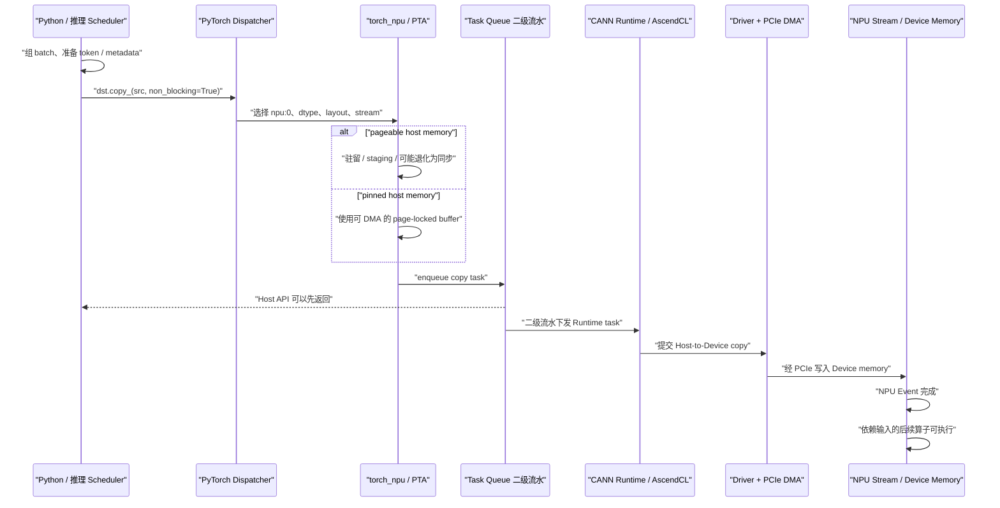
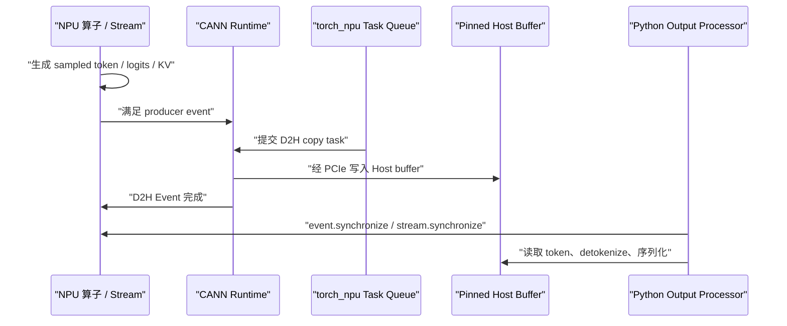

# 昇腾 910B4 推理 H2D / D2H 性能分析手册

这份手册把
[`04-h2d-d2h-profiling.md`](04-h2d-d2h-profiling.md)
中的通用测量方法映射到昇腾 910B4、`torch_npu`、CANN、`msprof` 和
MindStudio Insight。

实验入口仍然是
[`labs/h2d_d2h_benchmark.py`](../labs/h2d_d2h_benchmark.py)，通过
`--backend npu` 选择昇腾后端。

## 1. 范围与结论

- 本手册面向 Linux Host + 昇腾 910B4 的 PyTorch 在线推理或推理微基准。
- 910B4 可能出现在不同 Atlas A2 产品形态、裸机、容器或虚拟化环境中。
  必须记录服务器型号、EP/RC 模式、NPU 映射、CANN、驱动、固件、
  PyTorch 和 `torch_npu` 版本，不能只写“910B4”。
- Host↔Device 在典型 EP 模式下走 PCIe；HCCS 是 NPU 间互联。看到 HCCS
  带宽不能将其当作 H2D/D2H 带宽。
- pinned host memory 仍然是可靠异步 H2D/D2H 的前提。官方 MindIE Torch
  文档明确说明，异步 copy 的 CPU tensor 需要 `pin_memory=True`，否则没有
  异步效果。
- `torch_npu` 默认的异步执行路径还包含 task queue。Python
  `copy_()` 返回后，任务可能先进入 PyTorch/torch_npu 的下发流水，再进入
  CANN Runtime 和 NPU stream。因此必须同时测 host API、NPU Event 和完成时间。
- `ASCEND_LAUNCH_BLOCKING=1` 是调试配置，会强制同步并关闭 task queue。
  它能帮助定位隐式异步错误，但不能作为性能基线。
- `msprof` 的 PCIe 层是系统级采样，适合关联链路是否繁忙；单次 copy
  延迟仍应以 NPU Event 和应用 wall clock 为主。官方资料也提示部分 PCIe
  字段是粗粒度统计值。

## 2. NVIDIA 与昇腾工具映射

| 分层 | NVIDIA/A100 | 昇腾 910B4 |
|---|---|---|
| PyTorch 后端 | `torch.cuda` | `torch_npu.npu` / `torch.npu` |
| Device | `cuda:0` | `npu:0` |
| 执行栈 | ATen CUDA → CUDA Runtime/Driver | ATen → torch_npu/PTA → CANN Runtime/AscendCL → Driver |
| Stream | `torch.cuda.Stream` | `torch_npu.npu.Stream` |
| Event | `torch.cuda.Event` | `torch_npu.npu.Event` |
| 主机异步 copy | pinned + `non_blocking=True` | pinned + `non_blocking=True` |
| 自定义打点 | NVTX | mstx，旧资料称 msproftx |
| 框架 timeline | PyTorch Profiler | Ascend PyTorch Profiler |
| 系统 timeline | Nsight Systems | `msprof` + MindStudio Insight |
| 设备状态 | `nvidia-smi` | `npu-smi` |
| GPU/NPU 间互联 | NVLink/NVSwitch | HCCS |
| Host↔Device 链路 | PCIe | 典型 EP 模式为 PCIe |

`torch_npu` 当前支持 `Stream`、`Event` 和 `Event.elapsed_time`，因此实验能保持
与 CUDA 版本相同的五层指标语义。

## 3. 910B4 H2D 完整流程



需要区分：

1. **Python prepare**：请求调度、metadata packing、CPU tensor 写入。
2. **PyTorch/torch_npu host API**：dispatcher、格式与 device 检查。
3. **task queue**：主线程与二级下发线程之间的队列和唤醒。
4. **CANN Runtime API**：真正向设备 runtime 提交任务。
5. **stream queue**：等待同 stream 的前序算子或 copy。
6. **PCIe DMA**：Host memory 与 Device memory 之间的数据搬运。
7. **NPU consumer**：模型算子消费刚传入的数据。

`host_api_ms` 很短，只能证明主线程很快离开 `copy_()`，不能证明 task queue
没有积压，也不能证明 DMA 已经完成。

## 4. 910B4 D2H 完整流程



D2H 常落在 decode 的用户可见关键路径：

```text
NPU forward / sampler
→ producer event
→ D2H
→ Host wait 被唤醒
→ Python 读取
→ detokenize / 网络发送
```

以下操作可能把同步成本隐藏到后一个位置：

- `.cpu()` 后立即读；
- `.item()`；
- 打印 NPU tensor；
- 转 NumPy；
- output processor 直接访问尚未完成的 pinned buffer。

本实验会等待结束 Event 后再校验数据。

## 5. 分层指标

| 指标 | 910B4 测量方式 | 含义 |
|---|---|---|
| `cpu_prepare_ms` | Host monotonic clock | Python 准备和合成 work |
| `host_api_ms` | `copy_()` 前后 Host clock | PyTorch/torch_npu 调用返回时间 |
| `device_copy_ms` | 两个 NPU Event 的 `elapsed_time` | stream 上 copy 区间 |
| `completion_ms` | submit 到 Event wait 返回 | queue、copy、同步唤醒的可见完成延迟 |
| `pipeline_ms` | prepare 到完成 | 单次关键路径或 batch 摊销时间 |
| `device_copy_gbps_p50` | bytes / NPU Event time | Device 侧 copy 有效速率 |
| `effective_gbps_p50` | bytes / pipeline time | 应用真正得到的端到端速率 |

对 910B4，可以进一步写成：

```text
T_pipeline
= T_python_prepare
 + T_torch_npu_api
 + T_task_queue
 + T_cann_runtime
 + T_stream_queue
 + T_pcie_dma
 + T_event_wait_and_host_wakeup
```

如果只测 `copy_()`，会漏掉后六项中的大部分。

## 6. 环境与拓扑检查

### 6.1 软件版本

先加载部署环境对应的 CANN 环境脚本，再运行：

```bash
python3 - <<'PY'
import torch
import torch_npu

print("torch:", torch.__version__)
print("torch_npu:", torch_npu.__version__)
print("CANN:", torch_npu.utils.get_cann_version())
print("device:", torch_npu.npu.get_device_name(0))
print("properties:", torch_npu.npu.get_device_properties(0))
PY
```

PyTorch、`torch_npu`、CANN 必须来自兼容版本组合。不要在版本不匹配的环境下
解释微秒级结果。

### 6.2 NPU 与 PCIe 映射

```bash
npu-smi info
npu-smi info -m
npu-smi info -t topo
lspci -tv
lscpu
numactl --hardware
```

记录：

- `npu-smi` 与驱动版本；
- NPU ID、Chip ID、Logic ID、Bus ID；
- 910B4 所在 PCIe root complex；
- NPU 对应的 NUMA node 和 CPU 列表；
- 容器内 NPU ID 与物理机 ID 是否重新映射；
- 当前进程 CPU affinity 和 cgroup CPU set。

`npu-smi info -t topo` 在部分产品或容器环境可能不支持。此时用
`npu-smi info` 的 Bus ID、`lspci` 与
`/sys/bus/pci/devices/<BDF>/numa_node` 交叉确认。

### 6.3 会改变测量语义的环境变量

```bash
env | rg 'ASCEND_LAUNCH_BLOCKING|TASK_QUEUE_ENABLE|CPU_AFFINITY_CONF|ASCEND.*VISIBLE'
```

基线建议：

```bash
export ASCEND_LAUNCH_BLOCKING=0
export TASK_QUEUE_ENABLE=1
unset CPU_AFFINITY_CONF
```

这些只是对照起点，不是所有生产模型的最佳配置。尤其不要在共享生产环境直接
覆盖服务启动参数。

## 7. 实验一：完整基线矩阵

```bash
python3 labs/h2d_d2h_benchmark.py \
  --backend npu \
  --device npu:0 \
  --sizes 4KiB,1MiB,16MiB,64MiB,256MiB \
  --warmup 20 \
  --iterations 100 \
  --allocation-iterations 5 \
  --output-dir artifacts/ascend_h2d_d2h/baseline
```

覆盖：

```text
H2D / D2H
× pageable / pinned
× blocking / nonblocking
× sync-each / sync-batch
```

先检查：

1. `summary.json` 中 `backend` 为 `npu`，并记录正确的 device/CANN/环境变量。
2. pinned + nonblocking + batch 的大块有效带宽应进入相对稳定区。
3. 小 copy 的 `device_copy_gbps_p50` 不用于和链路理论值比较。
4. `host_api_ms`、`device_copy_ms` 和 `pipeline_ms` 不能被当成同一个指标。
5. pageable 与 pinned 的差异可能出现在 Host API、Device Event 或两者之间。

不要在没有对应服务器产品规格书的情况下给 910B4 设定统一 GB/s
验收线。公开文档中的 `h2d_bw` 配置示例也不是当前机器的保证值。

## 8. 实验二：Task Queue A/B

`TASK_QUEUE_ENABLE` 是 910B4 CPU 下发性能分析里必须单独控制的变量。

### Level 0：关闭 task queue

```bash
TASK_QUEUE_ENABLE=0 ASCEND_LAUNCH_BLOCKING=0 \
python3 labs/h2d_d2h_benchmark.py \
  --backend npu \
  --sizes 4KiB,64MiB \
  --iterations 200 \
  --output-dir artifacts/ascend_h2d_d2h/task-queue-0
```

### Level 1：默认二级流水

```bash
TASK_QUEUE_ENABLE=1 ASCEND_LAUNCH_BLOCKING=0 \
python3 labs/h2d_d2h_benchmark.py \
  --backend npu \
  --sizes 4KiB,64MiB \
  --iterations 200 \
  --output-dir artifacts/ascend_h2d_d2h/task-queue-1
```

### Level 2：进一步平衡一级/二级流水

```bash
TASK_QUEUE_ENABLE=2 ASCEND_LAUNCH_BLOCKING=0 \
python3 labs/h2d_d2h_benchmark.py \
  --backend npu \
  --sizes 4KiB,64MiB \
  --iterations 200 \
  --output-dir artifacts/ascend_h2d_d2h/task-queue-2
```

看这些关系：

- `host_api_ms` 是否下降；
- `batch` effective bandwidth 是否提升；
- `device_copy_ms` 是否基本不变；
- task queue 中间是否出现大 gap；
- p95/p99 是否改善；
- Level 2 是否增加 Device memory 峰值。

官方说明 Level 2 会迁移部分 workspace 工作并可能提高 NPU 内存峰值。不能只看
吞吐，不看内存。

### 同步负对照

```bash
ASCEND_LAUNCH_BLOCKING=1 \
python3 labs/h2d_d2h_benchmark.py \
  --backend npu \
  --sizes 4KiB,64MiB \
  --iterations 50 \
  --output-dir artifacts/ascend_h2d_d2h/launch-blocking-debug
```

这组用于验证“异步提交是否被同步模式改变”。它会关闭 task queue、降低性能，
不能和异步结果混合汇总。

## 9. 实验三：Python、二级流水线程与 OS 调度

### 9.1 Python prepare

```bash
python3 labs/h2d_d2h_benchmark.py \
  --backend npu \
  --sizes 4KiB,64MiB \
  --python-work 50000 \
  --iterations 200 \
  --output-dir artifacts/ascend_h2d_d2h/python-work
```

如果 `cpu_prepare_ms` 和 copy 间 gap 上升而 `device_copy_ms` 稳定，说明是
Host 供给不足，不是 PCIe DMA 本身变慢。

### 9.2 GIL 竞争

```bash
python3 labs/h2d_d2h_benchmark.py \
  --backend npu \
  --sizes 4KiB,64MiB \
  --interference gil \
  --iterations 200 \
  --output-dir artifacts/ascend_h2d_d2h/gil
```

### 9.3 OS 同核竞争

先从实际拓扑选择一颗 NPU 本地 CPU，例如用 `<cpu>` 代替：

```bash
python3 labs/h2d_d2h_benchmark.py \
  --backend npu \
  --sizes 4KiB,64MiB \
  --cpu-affinity <cpu> \
  --interference cpu \
  --cpu-workers 1 \
  --iterations 200 \
  --output-dir artifacts/ascend_h2d_d2h/os-contention
```

这会故意让主线程和 worker 争核，用于制造可重复的调度长尾。

### 9.4 `CPU_AFFINITY_CONF`

`torch_npu` 提供粗粒度和细粒度绑核：

```bash
CPU_AFFINITY_CONF=0 python3 labs/h2d_d2h_benchmark.py \
  --backend npu --sizes 4KiB,64MiB \
  --output-dir artifacts/ascend_h2d_d2h/affinity-0

CPU_AFFINITY_CONF=1 python3 labs/h2d_d2h_benchmark.py \
  --backend npu --sizes 4KiB,64MiB \
  --output-dir artifacts/ascend_h2d_d2h/affinity-1

CPU_AFFINITY_CONF=2 python3 labs/h2d_d2h_benchmark.py \
  --backend npu --sizes 4KiB,64MiB \
  --output-dir artifacts/ascend_h2d_d2h/affinity-2
```

细粒度模式会把 PTA 主线程、二级流水等热点线程锚定到不同 CPU。它可能减少
抢占、cache miss 和 migration，但如果业务还有 tokenizer、HTTP、output、
HCCL 或自定义线程，也可能因为核心不足而变差。

自定义范围示例：

```bash
export CPU_AFFINITY_CONF=2,npu0:<local-start>-<local-end>
```

不要同时用不一致的 `taskset`、`--cpu-affinity` 和 `CPU_AFFINITY_CONF`
做正式对照；先选一种控制方式。

## 10. 实验四：NUMA

根据 `npu-smi info -t topo`、Bus ID 和 `lscpu` 选择本地/远端 node：

```bash
numactl --cpunodebind=<local> --membind=<local> \
python3 labs/h2d_d2h_benchmark.py \
  --backend npu \
  --sizes 64MiB,256MiB \
  --host-memory pinned \
  --modes nonblocking \
  --iterations 100 \
  --output-dir artifacts/ascend_h2d_d2h/numa-local

numactl --cpunodebind=<remote> --membind=<remote> \
python3 labs/h2d_d2h_benchmark.py \
  --backend npu \
  --sizes 64MiB,256MiB \
  --host-memory pinned \
  --modes nonblocking \
  --iterations 100 \
  --output-dir artifacts/ascend_h2d_d2h/numa-remote
```

必须同时控制 CPU 和 memory policy。只把 Python 主线程绑到本地核，不能保证
pinned buffer 也分配在本地 NUMA node。

## 11. 实验五：Ascend PyTorch Profiler

### H2D

```bash
python3 labs/h2d_d2h_benchmark.py \
  --backend npu \
  --sizes 64MiB \
  --host-memory pinned \
  --modes nonblocking \
  --sync-policies each \
  --iterations 20 \
  --trace \
  --trace-direction h2d \
  --trace-size 64MiB \
  --trace-iterations 20 \
  --output-dir artifacts/ascend_h2d_d2h/torch-profiler-h2d
```

### D2H

```bash
python3 labs/h2d_d2h_benchmark.py \
  --backend npu \
  --sizes 64MiB \
  --host-memory pinned \
  --modes nonblocking \
  --sync-policies each \
  --iterations 20 \
  --trace \
  --trace-direction d2h \
  --trace-size 64MiB \
  --trace-iterations 20 \
  --output-dir artifacts/ascend_h2d_d2h/torch-profiler-d2h
```

脚本会使用：

```text
torch_npu.profiler.ProfilerActivity.CPU
torch_npu.profiler.ProfilerActivity.NPU
torch_npu.profiler._ExperimentalConfig(mstx=True)
```

旧版 `torch_npu` 参数名是 `msprof_tx`，脚本会自动回退。

在 timeline/MindStudio Insight 中对齐：

1. `cpu_prepare`；
2. `device_submit`；
3. PyTorch `aten::copy_`；
4. PTA/task queue 下发线程；
5. CANN Runtime copy API；
6. NPU 上对应的 H2D/D2H task；
7. `completion_wait`；
8. Host thread state。

不同 CANN 版本的 copy task 名称可能不同，不要只靠字符串搜索。应从同一
mstx range 横向关联 framework、CANN 和 Ascend Hardware 层。

## 12. 实验六：`msprof` 系统 timeline

```bash
msprof \
  --output=artifacts/ascend_h2d_d2h/msprof \
  --msproftx=on \
  --sys-profiling=on \
  --sys-pid-profiling=on \
  --sys-interconnection-profiling=on \
  python3 labs/h2d_d2h_benchmark.py \
    --backend npu \
    --sizes 4KiB,64MiB \
    --iterations 20 \
    --warmup 5 \
    --annotate \
    --output-dir artifacts/ascend_h2d_d2h/msprof-run
```

关键产物随版本略有差异，通常包括：

- `msprof_*.json` 或 `.db`：MindStudio Insight timeline；
- `msprof_tx_*.json/csv`：mstx 打点；
- `api_statistic_*.csv`：CANN API；
- `pcie_*.csv`：PCIe 系统采样；
- CPU/process usage；
- `ASCEND_PROFILER_OUTPUT` 下的 operator、memory、framework 数据。

`--sys-interconnection-profiling=on` 在 Atlas A2/Atlas 800I A2 场景可采集
PCIe、HCCS 和片间带宽。判读时：

- H2D/D2H 对齐 PCIe 层；
- NPU↔NPU/HCCL 对齐 HCCS；
- 不要把 HCCS 峰值当 Host copy 带宽；
- PCIe 层采样周期通常比单次小 copy 粗，不能替代 NPU Event；
- `msprof` 不能提供完整 Python 调用栈时，用 Ascend PyTorch Profiler 和
  `perf` 补齐。

## 13. 实验七：Host 调度、中断与 page fault

### `perf stat`

```bash
perf stat \
  -e task-clock,context-switches,cpu-migrations,page-faults,minor-faults,major-faults \
  -o artifacts/ascend_h2d_d2h/perf-stat.txt \
  python3 labs/h2d_d2h_benchmark.py \
    --backend npu \
    --sizes 4KiB,64MiB \
    --iterations 200 \
    --output-dir artifacts/ascend_h2d_d2h/perf-run
```

### `perf sched`

```bash
perf sched record -o artifacts/ascend_h2d_d2h/perf-sched.data -- \
  python3 labs/h2d_d2h_benchmark.py \
    --backend npu \
    --sizes 4KiB \
    --iterations 500 \
    --output-dir artifacts/ascend_h2d_d2h/perf-sched-run

perf sched timehist -i artifacts/ascend_h2d_d2h/perf-sched.data \
  > artifacts/ascend_h2d_d2h/perf-sched-timehist.txt
```

关注的不只是 Python 主线程，还包括 PTA/task queue 二级流水线程。典型问题：

- 主线程能 enqueue，但二级流水线程长期 runnable 未运行；
- 主线程与下发线程被绑在同一颗繁忙 CPU；
- NPU 本地 CPU 被 NIC/NVMe/driver IRQ 抢占；
- event 完成后 output thread 被唤醒但迟迟没获得 CPU；
- pinned buffer 首次触碰产生 page fault；
- CPU migration 导致 cache/TLB locality 变差。

脚本也会把当前进程 context switch/page fault 和全机 `/proc/interrupts`、
`/proc/softirqs` 差值写入 `summary.json`。IRQ 是全机相关性证据，不是进程归因。

## 14. 一键采集

在 910B4 服务器、已经加载 CANN 环境的仓库根目录运行：

```bash
bash labs/run_ascend_h2d_d2h_validation.sh \
  artifacts/ascend_h2d_d2h_validation
```

它会：

1. 保存 `npu-smi`、映射、拓扑、CPU 和 NUMA 信息；
2. 保存 PyTorch/`torch_npu`/CANN/device 信息；
3. 跑完整 NPU 基线矩阵；
4. 分别导出 H2D、D2H 的 Ascend PyTorch Profiler trace；
5. 安装 `msprof` 时采集 mstx、Host、process、PCIe/HCCS 系统 timeline；
6. 安装 `perf` 时采集 Host 调度计数。

## 15. 结果判读

| 观察 | 更可能的原因 | 下一步 |
|---|---|---|
| `host_api_ms` 高、`device_copy_ms` 正常 | 同步 copy、pageable staging、task queue 关闭、Host 被抢占 | pinned；检查 blocking 与环境变量；看 Host stack |
| Host API 快、task queue 到 CANN 有大 gap | 二级流水线程调度不足或队列积压 | `CPU_AFFINITY_CONF` A/B；看 PTA thread state |
| `device_copy_ms` 正常、`pipeline_ms` 尾部高 | queue、Event wait 唤醒、Python/OS 调度 | `perf sched`、mstx、completion wait |
| 大块 `device_copy_ms` 变长 | PCIe/NUMA/DDR、并发 copy、链路争用 | PCIe layer、NUMA A/B、同机进程 |
| Level 2 吞吐提高但内存峰值增加 | workspace 下发迁移带来的并发 | 同时检查 NPU memory 与业务余量 |
| `ASCEND_LAUNCH_BLOCKING=1` 后 Host API 激增 | 异步提交被强制同步，符合预期 | 恢复 0 做正式性能测试 |
| p50 正常、p99 与 context switch 同时升高 | Host 线程抢占、CPU migration、IRQ | 本地核隔离和 affinity A/B |
| `pcie_*.csv` 很忙但单次 Event 正常 | 系统同时存在其他 PCIe 流量或采样太粗 | 对齐精确时间窗和进程 |
| HCCS 很忙、H2D 正常 | NPU 间通信压力，不是 Host copy | 分开 HCCL/HCCS 与 H2D 根因 |

## 16. 映射到真实推理服务

在 MindIE、vLLM Ascend、SGLang Ascend 或自研服务中，至少添加：

```text
request/batch_id
  cpu_schedule_begin/end
  metadata_pack_begin/end
  h2d_submit_begin/end
  h2d_npu_event
  task_queue_enqueue/dequeue（框架可观测时）
  model_execute_begin/end
  d2h_submit_begin/end
  d2h_npu_event
  output_cpu_consume_begin/end
```

每个 batch 关联：

- prefill/decode phase；
- sequence/token 数；
- H2D/D2H 字节数；
- pageable/pinned；
- stream 与 Event；
- `TASK_QUEUE_ENABLE`、`ASCEND_LAUNCH_BLOCKING`；
- Host 主线程与二级流水线程 ID/CPU；
- NPU/NUMA/Bus ID；
- TTFT、ITL、TPOT。

这样才能区分：

```text
Python 没准备好
vs task queue 没及时下发
vs CANN/stream 前序依赖
vs PCIe copy 真正变慢
vs Event 完成后 Host 没及时被调度
```

## 17. 实验纪律

- profiler 与无 profiler 数字分开；
- 每次只改一个变量；
- `ASCEND_LAUNCH_BLOCKING=1` 只作为调试负对照；
- task queue 0/1/2 分目录保存；
- affinity 0/1/2 分目录保存；
- 同时记录 CANN、驱动、固件、PyTorch 和 `torch_npu`；
- 保留原始样本，比较 p50/p95/p99；
- 小 copy 看固定开销，大 copy 看稳态；
- PCIe sampling、NPU Event、Host clock 三种证据互相校验；
- microbenchmark 解释机制，最终仍需在真实 decode/prefill 请求中关联 TTFT/ITL。

## 18. 官方参考

- [昇腾产品形态与 EP/RC、Host/Device 定义](https://www.hiascend.com/document/detail/en/mindstudio/700/Referenceinformation/productdescription/hardwaredesc_0001.html)
- [MindIE Torch：同步/异步数据拷贝与 pinned memory](https://www.hiascend.com/document/detail/zh/mindie/10RC3/mindietorch/Torchdev/mindie_torch0016.html)
- [Ascend Extension for PyTorch：Stream/Event API 支持](https://www.hiascend.com/document/detail/zh/Pytorch/720/apiref/PyTorchNativeapi/ptaoplist_000163.html)
- [Ascend PyTorch Profiler 数据采集](https://www.hiascend.com/document/detail/en/CANNCommunityEdition/900/devaids/Profiling/atlasprofiling_16_0033.html)
- [mstx 自定义打点](https://www.hiascend.com/document/detail/en/canncommercial/850/devaids/profiling/atlasprofiling_16_0033.html)
- [`msprof` 通用采集命令](https://www.hiascend.com/document/detail/en/canncommercial/850/devaids/profiling/atlasprofiling_16_0010.html)
- [Atlas A2/800I A2 的 PCIe/HCCS 系统采集](https://www.hiascend.com/document/detail/en/canncommercial/850/devaids/profiling/atlasprofiling_16_0012.html)
- [`ASCEND_LAUNCH_BLOCKING`](https://www.hiascend.com/document/detail/zh/Pytorch/710/comref/Envvariables/Envir_006.html)
- [`TASK_QUEUE_ENABLE`](https://www.hiascend.com/document/detail/zh/Pytorch/710/comref/Envvariables/Envir_007.html)
- [`CPU_AFFINITY_CONF`](https://www.hiascend.com/document/detail/zh/Pytorch/720/comref/Envvariables/Envir_033.html)
- [`npu-smi info -t topo`](https://www.hiascend.com/document/detail/zh/Atlas%20200I%20A2/2550/re/npu/topic_0000002481546284.html)
